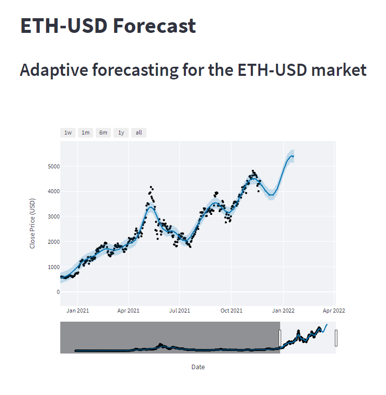
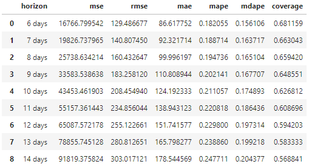

 

Live app: https://share.streamlit.io/ltw85/etherium-forecast-project/main/app.py

## Overview
The primary goal of this project is to provide automated forecasts for the ETH-USD market that account for contemporary market conditions.
This is a central problem with regards to such markets as they are generally highly volitile and unstable.

To address this issue, the Prophet algorithm was selected as it offers many favorable attributes and functionalities in terms of forecasting 
a cryptocurrency market. Prophet employs a flexible curve-fitting process that is fast, able to handle outliers and 'shocks' reasonably well, and functions best where 
strong seasonal trends are present - all of which apply to many cryptocurrency markets. 

The main draw for Prophet, however, is the ability to tune certain hyper-parameters that will enable the Prohpet algorithm to adapt the modelling process to
current market conditions. This in turn affords consistently relevant forecasts - particuarly when the tuning procedure is automated.

The result of this project is a Streamlit web app that provides forecasts for the ETH-USD market which adapt to current market conditions.

## Data
Data for this project is collected daily from Yahoo Finance and concerns daily close prices for the ETH-USD market. The data is cleaned and missing
price values as well as dates are filled in (though Prophet can function well with missing data).

## Hyper-parameter Tuning, Cross-validation, and Automation 

*Hyper-parameter tuning*

Three hyper-parameters - changepoint_prior_scale, seasonality_prior_scale, and changepoint_range are tuned via a grid-search. The first two 
hyper-parameters have the effect of applying l1 (lasso) and l2 (ridge) regularisation to the curve-fitting process respectively. A combination of both results in
an effect akin to elasticnet. In this sense, larger values - particuarly for changepoint_prior_scale - will 'relax' the fit allowing for room to track trends closely, and smaller values will offer a 'tight' fit. A 'tighter' fit is likely to produce more accurate forecasts when a market is ranging and could further have the ability to catch breakouts when the tuning is automated. A 'relaxed' fit may produce more accurate forecasts 
when a market is trending. Thus, given an appropriate window within the test data for tuning, it may be possible for the Prothet algoithm to adjust 
the modelling process and provide forecasts that reflect current market conditions. As new data is gathered everyday, if the market starts ranging, the fit will become more 'tight'. Conversely, if the market starts trending, the fit will become more 'relaxed'. The longer each of those conditions persist, the more 'tight'/'relaxed' the fit will become. 

By default, changepoints are inferred by the Prophet algorithm using the first 80% of the time series. This is to avoid overfitting fluctuations at the end of the series before the trend is projected forward (see link to Prophet docs below for futher information). However, when attempting to adapt the modeling process to contemporary market condition, it can be important to take those fluctuations into account. The changepoint_range parameter denotes the percentage of the time series for which changepoints are inferred and thus is also tuned.

*Cross-validation*

Currently, cross-validation is performed using pre-defined cutoff periods in the dataset that capture contemporary market conditions. A method of dynamically selecting an optimal window and cutoffs will be the subject of future 
research and development. At the time of writing (Nov - 2021), cross-validation performance metrics suggest that generally, a maximum forecast horizon of 10 - 14 days is most appropriate after which accuracy decreases rapdily. Cross-validation performance metrics for a 14 horizon are provided via the Streamlit app. This outcome is likely due to a stongly trending market. When the market is ranging, it may be possible to produce more accurate forecasts at a longer horizon.

After the hyper-parameter tuning and cross-validation procedures mentioned above have been carried out, it appears that the tuned model offers better results. This can be demonstrated by comparing error metrics for an example baseline model (no regularisation and default changepoint range of 80%), and an example model tuned for contemporary conditions:

**Baseline**

*Averages across 46 fits*

**Tuned Model**

*Averages across 46 fits*

*Automation*

In order for the project to provide forecasts that adpat to market conditions, the tuning process has been automated via Github Actions. The process follows the steps below:

**Step 1:** A .yaml file containing a workflow procedure is executed on a schedule - currently once a day. 

**Step 2:** The workflow runs the model_tuning.py script which performs the grid-search to find optimal values for changepoint_prior_scale, seasonality_prior_scale, and changepoint_range - based on contemporary market conditions. A model is then built using the optimal values and cross-validation is completed. Output is formatted in a user-friendly manner. The selected hyper-parameter values and performance metrics are then saved as .pickle files.

**Step 3:** Both .pickle files are commited and pushed back to the Github repository via the workflow procedure

**Step 4:** Everytime the Streamlit app in run, values are read in from the .pickle files for changepoint_prior_scale, seasonality_prior_scale, and changepoint_range. A model is built using these values and the forecast is displayed. The current cross-validation performance metrics are also read in and displayed (14 day horizon). The Prophet algorithm is very fast which helps to make this process viable using Github Actions. 

## Notes and Acknowledgements
A (free) Streamlit account is required in order to build the web app component.

Interval widths to be displayed can be selected from the Streamlit app interface.

When executing the app using Streamlit, a model can be built and results displayed generally within 15 - 25 seconds. 

Hyper-parameter tuning and cross-validation using the model_tuning.py script generally takes between 15 - 20 minutes to complete.

For more information:

Prophet -- https://facebook.github.io/prophet/docs/installation.html

Streamlit -- https://streamlit.io/

Github Actions -- https://github.com/features/actions

## Download
`git clone https://github.com/LTW85/Etherium-Forecast-Project.git`

